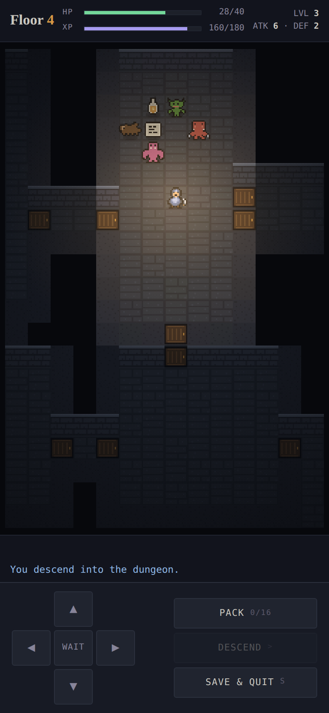

# Cli-game-

A terminal roguelike dungeon crawler built with [Textual](https://textual.textualize.io/).

Procedurally generated dungeons, a different one every run, explored one turn at a
time by torchlight — with things in the dark that hunt you.


A run moves through three screens — the title screen picks a seed, the game screen
plays it out, and the game over screen reports how it went before handing back a
fresh seed.

| | |
|---|---|
|  |  |

Aiming a thrown flask — the cursor sits on the target, the tiles around it are the
blast it would cover:


## Status

All ten roadmap steps are complete, and so are the five stretch goals. A run goes:
pick a seed, descend, explore under fog of war, fight things that each hunt you
differently, level up on what you kill, gear up from what you find, take the stairs
into something worse, and eventually die — permanently — to a screen that tells you
how far you got. You can suspend a run to disk and pick it up later, but you cannot
rewind one.

- [x] 1. Project scaffold
- [x] 2. Dungeon generation (BSP rooms + corridors, seeded)
- [x] 3. Rendering (`@` player, `#` wall, `.` floor, `+` door)
- [x] 4. Player movement with collision detection
- [x] 5. Fog of war (shadowcast FOV, remembered tiles drawn dim)
- [x] 6. Entities & combat (chase-on-sight AI, bump-to-attack, death)
- [x] 7. Inventory & items (potions, weapons, scrolls; walk-over pickup, `i` to open)
- [x] 8. Stairs & floor progression (`>` descends into a harder floor)
- [x] 9. Permadeath + game over screen (run stats, then a fresh seed)
- [x] 10. Status panel (health, gear, pack, and what is nearby)

### Stretch goals

- [x] Save/load game state to JSON (suspend a run; loading consumes the save)
- [x] Ranged items (thrown flasks and a targeted fireball scroll, with an aiming cursor)
- [x] Enemy variety — different stats *and* behaviours per floor depth
- [x] Message log panel (combat, pickups, deaths)
- [x] Colorized tiles and entities via Textual styling

### Beyond the brief

- [x] Character progression — experience, levels, and stat gains, so the player's
      power curve keeps pace with the dungeon's

## Three builds

| | |
|---|---|
| `roguelike/` | The Python + Textual terminal game. The reference implementation — the rules live here. |
| `web/ember-depths.html` | A browser port that keeps the ASCII presentation. |
| `web/ember-depths-pixel.html` | The same game with hand-drawn pixel art on a canvas. |



The pixel build began as a re-skin of the browser port and has since grown its
own rules: furniture, chests, braziers and a boss on every floor. The parts they
still share — generation, field of view, species behaviour, items, combat
arithmetic, levelling — remain identical. What differs:

- **Sprites are drawn in code.** `web/sprites.js` holds every tile and creature
  as a 16x16 grid of palette letters, painted into offscreen canvases once at
  start-up. There are no image files, so the art can be edited a pixel at a time
  in the source.
- **The floor is 52x38 rather than 80x45.** A sprite viewport shows about
  14x21 tiles where the text one showed 32x25; on the larger map that was a
  keyhole. Room density is unchanged, so a floor still holds a comparable number
  of monsters and items — the measuring bot reaches floors 4-6 either way.

Light does the rest of the work: a warm pool that breathes around the player,
three steps of falloff to the edge of sight, a flat dimness for rooms held in
memory, and unexplored ground painted back to black so the torch never spills
onto what has not been seen.

### Animation

The dungeon moves, but the rules do not. A turn still resolves instantly, exactly
as it does in the terminal. What the screen shows is worked out afterwards by
comparing a snapshot taken before the turn with the state after it — who moved,
who was hurt, who stopped existing — and playing that difference out:

| | |
|---|---|
| Steps | entities slide between tiles, and the camera chases rather than snapping |
| Attacks | the attacker shoves toward its target; the target whites out and sheds a damage number |
| Taking a hit | the view shakes |
| Deaths | the sprite fades and lifts while sparks scatter in its own colour |
| Thrown flasks | the flask arcs and tumbles, and its damage is held back until it lands and bursts |
| Levelling | a ring of light expands from the player |
| Descending | the new floor lights up out of the dark |
| Always | idle bob on every creature, items rocking gently, dust drifting through the torchlight |

Because the animation only ever reads state, it cannot change the game. The
measuring bot returns identical runs before and after it was added — same floors,
kills, turns and killers, seed for seed — which is the check that keeps the
balance work valid.

### Sound

Every sound is synthesised at runtime from oscillators and filtered noise — the
same principle as the sprites being drawn in code. There are no audio files,
which is just as well, since the page is served under a policy that would refuse
them.

Sounds hang off the same before-and-after comparison the animation uses, so a
swing, an impact and a death land in the order they happened, and a thrown
flask's burst waits until it lands. Steps, blocked steps, drinking, wielding,
reading, levelling, descending and dying each have their own voice, over a low
room tone with the occasional drip so silence never reads as a fault.

Browsers refuse to start audio until someone interacts with the page, so the
context opens on the first press and everything before it is silent by design.
The speaker in the status bar mutes it; the choice is remembered, and while muted
the synth builds no audio nodes at all.

### The floor map

`m`, or the Map button, opens a plan of the floor drawn entirely from what has
been explored — never from the floor plan itself, so it shows only ground the
player has stood in the light of. Rooms and corridors in stone grey, doors in
amber, the stairs down in green once found, remembered loot as single points,
anything currently in sight in red, and the player pulsing in gold. The heading
reports how much of the floor has been walked and whether the way down has
turned up yet.

The map is a plan, not a periscope: while it is open the dungeon takes no input,
so it cannot be used to look around a corner during a fight. Chests you have
seen are marked in gold and a boss in sight in pink, since those are the two
things worth walking towards.

### Furnished floors

Rooms are dressed from a theme — hall, store, crypt, barracks, shrine, ruin —
rather than left as bare rectangles, and the amount of furniture scales with the
floor space. Grand halls get a colonnade of pillars and braziers at the corners
instead of a scatter, so architecture reads as intent.

| | |
|---|---|
| Braziers | throw their own pool of light, up to three to a room |
| Pillars | solid, immovable, and in the way |
| Chests | walk into one to prise it open for an item |
| Barrels, crates | walk into one to smash it; about two in five hide something |
| Bones, rubble, rugs | dressing, walked straight over |

**Nothing furniture does can seal a floor off.** A solid piece is only kept if a
flood fill shows every open tile is still reachable without it, so crowding a
room can never cut it off. A test generates fifty floors and checks exactly that.

### Bosses

Every floor is ruled by one, standing in the room with the stairs, so the way
down has to be taken from something. Each is the crowned form of the species
that rules that depth — Rat King, Goblin Chieftain, Orc Warlord, Ogre Tyrant,
Wraith Lord — with its own sprite, a name and health bar across the top of the
dungeon while it is in sight, and whatever it was guarding left on the floor
where it fell.

They are costed against the player's actual strength at the depth they appear,
taking roughly a third to a half of a full health bar to bring down, and are
worth about a level in experience. The first attempt was not costed at all and
the measuring bot died to the floor-one Rat King in three runs out of five.

## Playing it on a phone

`web/ember-depths.html` is a self-contained browser port — one file, no build step,
no dependencies. Open it in any browser, or serve the folder and visit it from a
phone on the same network.

It carries the rules over faithfully: the same BSP generation, the same shadowcast
field of view, the same species, items, combat arithmetic and balance figures. A
test compares the two builds' difficulty tables floor by floor and they match
exactly. Two things are deliberately different:

- **Seeds do not correspond.** The terminal build draws from Python's random number
  generator, which the browser cannot reproduce, so the same seed number builds a
  different dungeon in each.
- **It is built for a touchscreen.** Tap a tile to step toward it, or use the thumb
  pad; a run is suspended to `localStorage` rather than to a file. Torchlight also
  falls off across three steps of brightness rather than the terminal's two, which
  is the one thing the browser can do that a terminal cannot.
- **It is harder.** Furniture blocks the way and bosses hold the stairs, which
  costs the measuring bot two floors: 2-5 here against 4-6 in the text builds.

The Python build in `roguelike/` remains the reference implementation.

## Quick start

```bash
python3 -m venv .venv
source .venv/bin/activate          # Windows: .venv\Scripts\activate
pip install -r requirements.txt

python -m roguelike
```

Installing the package instead (`pip install -e .`) also gives you a `roguelike`
command on your PATH.

## Controls

| Key | Action |
| --- | --- |
| `↑` `↓` `←` `→` | Move |
| `W` `A` `S` `D` | Move |
| `K` `J` `H` `L` | Move (vi keys) |
| `Space` `.` | Wait a turn |
| `I` | Open the pack (`a`-`p` to drink, wield, or aim; `esc` to close) |
| `>` | Take the stairs down |
| `Shift`+`S` | Suspend the run to disk and exit to the title screen |
| `N` | Abandon this run, back to the title screen |
| `Q` | Quit |

On the title screen, `Enter` begins, `R` rolls a different seed, and `C` continues
a suspended run.

Choosing a thrown item from the pack starts **aiming**: the arrow keys move the
cursor, `Tab` jumps to the next monster in reach, `Enter` throws, and `Esc` puts it
away. The tiles the blast would cover are highlighted, and the cursor turns red
where you have no shot.

Walking into a monster attacks it. Every action you take — moving, attacking, or
waiting — gives the dungeon a turn back.

## Tiles

| Glyph | Meaning |
| --- | --- |
| `@` | You |
| `#` | Wall |
| `.` | Floor |
| `+` | Door (blocks sight, so rooms stay dark until you step in) |
| `>` | Stairs down (step 8) |
| `r` `g` `o` `O` `W` | Rat, Goblin, Orc, Ogre, Wraith |
| `!` | Potion, or a flask to throw |
| `/` | Weapon |
| `?` | Scroll |

Items are picked up by walking over them.

Tiles in view are drawn bright; tiles you have seen before but cannot currently
see are drawn dim. Unexplored tiles are blank, and monsters are only drawn when
you can actually see them.

## File structure

```
.
├── pyproject.toml           # package metadata, deps, pytest config
├── requirements.txt         # runtime deps (textual)
├── requirements-dev.txt     # runtime deps + pytest
├── roguelike/
│   ├── __init__.py
│   ├── __main__.py          # `python -m roguelike`
│   ├── map_gen.py           # BSP dungeon generation, TileMap, tile glyphs
│   ├── fov.py               # recursive shadowcasting, Bresenham line of sight
│   ├── entities.py          # Entity / Actor / Player / Monster + species table
│   ├── combat.py            # melee damage resolution
│   ├── inventory.py         # items, their effects, and the pack
│   ├── persistence.py       # saving a run to JSON and reading it back
│   ├── game.py              # GameState: the whole run, turn loop, AI, camera
│   └── main.py              # Textual app: screens, MapView, log, status panel
├── docs/
│   ├── screenshot.svg       # all captured from real sessions
│   ├── title.svg
│   ├── inventory.svg
│   ├── aiming.svg
│   └── game-over.svg
└── tests/
    ├── helpers.py           # build a GameState from an ASCII drawing
    ├── test_map_gen.py      # determinism, structure, connectivity
    ├── test_fov.py          # shadowcasting, shadows, line of sight
    ├── test_game.py         # movement, collision, camera
    ├── test_ai_combat.py    # fog of war, monster AI, combat, death
    ├── test_items.py        # pickup, potions, weapons, scrolls, spawning
    ├── test_floors.py       # stairs, descending, the difficulty curve
    ├── test_run_stats.py    # permadeath, what killed you, the run summary
    ├── test_behaviour.py    # how each species spends its turn
    ├── test_ranged.py       # aiming, blast radius, and refused throws
    ├── test_persistence.py  # JSON round trips and refusing bad saves
    ├── test_progression.py  # experience, levels, and the difficulty curve
    ├── test_combat_inventory.py
    └── test_app.py          # drives the real app headlessly
```

## Levelling

Killing things earns experience, worth more for tougher monsters and for the
harder specimens found deeper down. Experience is derived from the stats a
monster actually spawned with rather than a number on the species, so the tables
only need one set of figures.

Each level grants:

| | |
|---|---|
| Maximum health | `+5`, granted as healing too, so a hard-won kill can carry you into the next fight |
| Attack | `+1` every second level |
| Defense | `+1` every third level |

Each level costs more than the one before it (`60 × current level`), so
progression slows without ever stopping.

## Design notes

- **One state object.** Everything mutable about a run lives on `GameState`.
  The UI holds a reference to it, asks it to perform actions, and redraws — it
  keeps no game data of its own.
- **Seeded randomness only.** `GameState.rng` is a `random.Random` created from
  `GameState.seed`; dungeon generation and every later system draw from it. The
  seed is shown in the sidebar, so any run can be replayed exactly.
- **Connected dungeons.** BSP guarantees non-overlapping rooms, and every
  internal node joins its two subtrees with an L-shaped corridor, so the whole
  floor is always one connected component. A test flood-fills 50 seeds to prove it.
- **Camera.** The map is larger than most terminals, so `camera_origin()` frames
  a viewport on the player, clamped to the map edges.
- **Visibility.** `fov.py` computes what the player can see with recursive
  shadowcasting over eight octants, and takes a `blocks_sight(x, y)` predicate
  rather than a map, so it stays independent of how tiles are stored.
  `GameState.visible` is recomputed each turn; `GameState.explored` accumulates
  and is never cleared while you are on a floor.
- **Monster sight.** Monsters use a cheap Bresenham line-of-sight check instead
  of a full FOV cast — one line per monster per turn rather than eight octants.
- **Turn loop.** A player action that succeeds spends a turn, then every living
  monster acts, then visibility is recomputed and death is checked. A move into
  a wall fails and costs nothing, so the dungeon does not get a free hit.
- **Items.** An item's effect is a function of the `GameState`, so a scroll can
  heal, burn, teleport, or redraw the map without the item system needing its
  own hooks into everything. `inventory.py` imports `GameState` only under
  `TYPE_CHECKING`, which keeps the dependency pointing one way.
- **Floors.** `generate_floor()` builds a floor and drops the player at its
  entrance; the player object itself is untouched, so it serves both the start
  of a run and arrival on a deeper floor. Stairs go in the room furthest from
  the entrance, so a floor cannot be crossed in a couple of steps.
- **Screens.** The title, game, inventory, and game over screens are separate
  Textual screens, so only one of them can be driven at a time — you cannot walk
  the dungeon with the pack open, or from behind the game over report. The two
  modal screens handle their keys in `on_key` rather than as bindings, because
  stopping an event (which is what keeps it off the dungeon below) also stops it
  before binding processing.
- **Permadeath.** `GameState` refuses every action once `game_over` is set, and a
  new run builds a whole new `GameState` — nothing is carried across but the
  summary shown on the title screen.
- **Suspending, not save-scumming.** A save is a way to stop playing, not a way
  to retry: loading deletes the file on the way in, and dying deletes it too. So
  a run can be put down and picked up, but never rewound. The generator's own
  internal state is part of the save, so a resumed run produces exactly the
  floors an uninterrupted one would have — there is a test that plays the same
  moves both ways and compares the results.
- **Behaviour, not just stats.** Bigger numbers deeper down only go so far, so
  each species also spends its turn differently: rats break and run when hurt,
  ogres act every other turn but hit like a truck, and wraiths remember where
  you were and keep coming after they lose sight of you.
- **Progression is balanced against the dungeon, not just added to it.** Levelling
  raises the player's ceiling, so monsters gain attack with absolute depth to
  match. Without that second half, descending made the game *easier* — see below.
- **Aiming.** Throwing is a mode on the game screen rather than another screen,
  because the map underneath has to stay visible and keep updating. While it is
  active the movement keys drive a cursor instead of the player, and every other
  action is held back.

## Development

```bash
pip install -r requirements-dev.txt
pytest
```

538 tests. The suite covers the generator (determinism, no overlapping rooms,
flood-filled connectivity across 50 seeds), the FOV algorithm (shadows, gaps,
radius limits), the turn loop, per-species AI, items, ranged throws, descent,
levelling, run stats and JSON round trips on hand-drawn ASCII maps, and a set of
end-to-end tests that drive the real Textual app headlessly — through the title
screen, a run, aiming and throwing, suspending and resuming, death, and back
again. Two of them guard the difficulty curve itself.

Because everything random comes from the seeded `GameState.rng`, a whole run
replays exactly: the same seed plus the same key presses gives the same result,
down to the message log.

## Balance

The difficulty curve was tuned against measurement rather than taste. A scripted
bot plays whole runs — exploring, fighting, drinking potions, wielding the best
weapon it finds — and reports how deep it gets.

The first version of steps 7–8 was unplayable past floor 2: a single Orc cost
50% of the player's maximum HP, an Ogre 107%, and a Wraith 120%, so the deeper
species could never actually be met. Three changes fixed the curve:

- Monster attack values were cut so a standard monster costs 3–13% of the
  player's HP per fight and an elite 27–40%, with nothing able to one-shot a
  healthy player (there is a test asserting exactly that).
- Each weapon tier now unlocks one floor *before* the monster it answers, and
  every floor is guaranteed to contain at least one weapon — the player's attack
  only grows by finding one, so it should not be left entirely to chance.
- Taking the stairs restores some health. Healing on descent rather than every
  turn means it cannot be farmed by standing still.

The same bot now reaches floors 3–4 instead of 1–2. It plays badly on purpose —
it walks straight at everything it sees and never retreats — so a human should
get further.

Adding thrown items and per-species behaviours later did not move that number:
flasks of fire give the player real burst damage, but slow ogres and stalking
wraiths push back, and the bot still landed on floors 2–4.

### Levelling, and the trap in it

The player's maximum health used to be fixed at 30 for a whole run, which put the
deep floors permanently out of reach. Character levels fixed that — but the first
version overcorrected, and not in a way the bot revealed: it went *deeper*
(floors 2–7), which looked like a success.

Working out the cost of the nastiest fight on each floor told the real story:

```
floor      1     2     3     4     5     6     7     8
before    13%   22%   14%   17%   15%   13%   12%   11%
```

Descending was making the game *easier*. The player's `+5` health a level was
outrunning the monsters' `+1` health per floor since their species arrived, so
by floor 8 the worst thing down there cost half what a floor-2 orc did. The bot
only died to attrition — enough monsters, eventually — rather than to anything
being dangerous.

The fix came from a small parameter search over the player's per-level gains and
the monsters' per-floor gains, scoring each combination on how many floors landed
in a 20–32% band and whether danger held steady with depth. It settled on `+5`
health a level for the player, and one more point of attack for everything living
two floors further down:

```
floor      1     2     3     4     5     6     7     8
after     13%   23%   20%   20%   20%   22%   23%   22%
```

The bot now reaches floors 2–6 rather than 2–4, with the deepest species finally
in play, and two tests keep it that way: one asserts the worst fight on every
floor stays inside that band, and one asserts danger never fades with depth.

Still unsolved, and inherent to the bot rather than the balance: it walks straight
at everything it sees and never retreats, so it is a floor on what the game
allows, not a ceiling.
